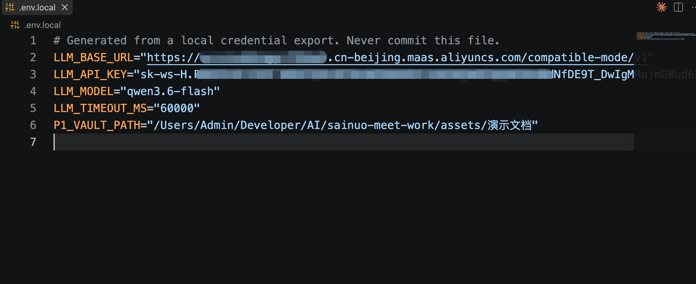

# Lumen · 技术文档精读助手

公司 AI 产品应用开发面试作业的交付仓库。Lumen 是一款面向软件开发者、把一份陌生技术规范或架构文档转成「可执行精读路线」的 Web 应用。

> 技术栈、功能边界、当前问题等信息以迁移，详见 [`DELIVERY_AND_DEPLOYMENT.md`](./DELIVERY_AND_DEPLOYMENT.md)
> 本地提供了[MyBatisPlus数据库事务代码规范.pdf](./assets/演示文档/MyBatisPlus数据库事务代码规范.pdf)示例的目标精读文档

## 产品功能介绍

### 它解决什么问题

开发者第一次读 RFC、协议规范、架构设计或原理说明类长文档时，真正卡住他们的往往不是缺少摘要，而是：

- 不知道文档解决什么问题、哪些章节该先读。
- 概念之间存在依赖，按原文顺序读未必适合当前基础。
- 规范关键词、约束、例外和版本边界容易被概括性摘要丢掉。
- 通用聊天回答可能脱离原文，无法核对出处。
- 读过的理解没有沉淀，下次还要重新梳理。

### 核心闭环

> 导入文档 → 设置阅读画像 → 文档地图与路线 → 阶段精读 → 引用定位 → 编辑并确认笔记 → Markdown 导出

Lumen 的差异化由四个连续行为构成：

1. **阅读适配**：由阅读目标和熟悉程度决定路线，而不是机械按目录总结。
2. **机制拆解**：突出概念依赖、数据流、约束、例外和落地含义。
3. **可信引用**：所有原文事实可定位到来源片段，证据不足时明确说明「文档中未找到足够依据」。
4. **确认式沉淀**：AI 只提出笔记草稿，用户确认后才成为最终成果。

### 主要能力

- **来源导入**：支持带文本层的 PDF、Markdown、TXT、HTML 文件，以及用户指定公开 URL；不主动联网搜索。
- **文档分类与质量告警**：自动区分规范 / 组织约束 / 教程 / 架构设计，识别大书（`book`）与截图型文档并给出降级告警。
- **阅读画像**：阅读目标（概览 / 机制 / 实现）与熟悉程度（初学 / 了解 / 熟练）驱动路线生成。
- **文档地图与路线**：结构化地图 + 3–6 个阶段，每阶段说明目标、涉及章节、前置阶段和推荐理由。
- **阶段精读**：流式讲解、理解检查、追问、换一种解释，全部基于当前文档的真实来源片段。
- **确认式笔记**：每阶段生成可编辑草稿，接受或跳过由用户决定，未接受内容不进入导出。
- **Markdown 导出**：固定结构笔记可下载，引用索引与来源元数据齐全。

## 体验方式

### 本地运行

要求 Node.js 20+ 环境。

需要依照[.env.example](./.env.example)在跟目录自行生成`.env.local`以写入大模型服务配置

模型配置保存在不会提交的 `.env.local`

若已有`.env.local`则忽略



控制台执行：
```bash
npm install
npm run config:import -- /absolute/path/to/api-config.csv
npm run dev
```

浏览器访问 [http://localhost:3000](http://localhost:3000)。

### 建议体验路径

从门面首页点击「立即体验」→ 导入 MyBatis 规范 → 选择阅读画像 → 生成路线 → 开始首阶段 → 打开来源 → 结束阶段 → 生成并编辑草稿 → 接受 → 导出笔记。

路线未完成时可点击「暂时离开」，确认后清理当前匿名会话并返回门面首页；全部阶段完成后点击「学学别的」返回门面首页。当前本地实测为 57 页、80 个来源块、4 阶段路线；刷新后会恢复 TTL 内会话并定位到下一个待开始阶段。

### 使用限制

- 会话为匿名临时会话，最后活动 2 小时后清理；开发服务器重启后允许丢失。
- 页面会披露：文档会发送给模型供应商，不应上传敏感或无权处理的资料。
- AI 输出是阅读辅助，不能替代原规范和技术评审。

## 交付与部署

首版产品边界、部署与上线方案、部署前提（P6 前需确认）、技术栈与验证结果，详见 [`DELIVERY_AND_DEPLOYMENT.md`](./DELIVERY_AND_DEPLOYMENT.md)。产品与技术的完整设计基线、验收证据和开发过程文档统一收录在 [`docs/README.md`](./docs/README.md)。
