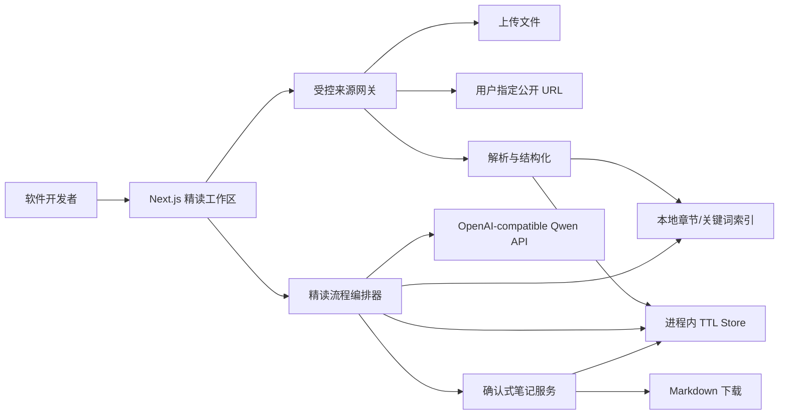
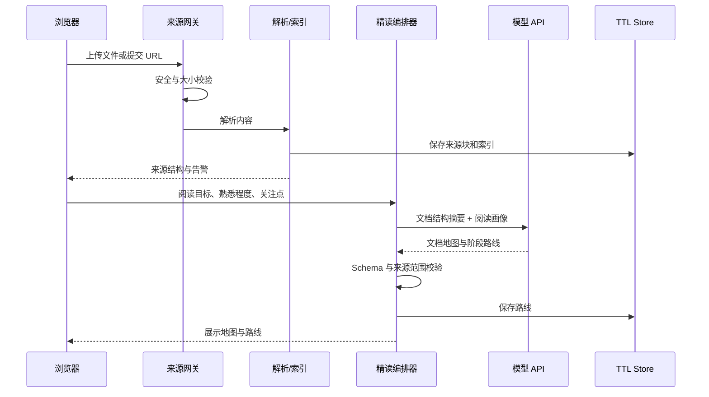
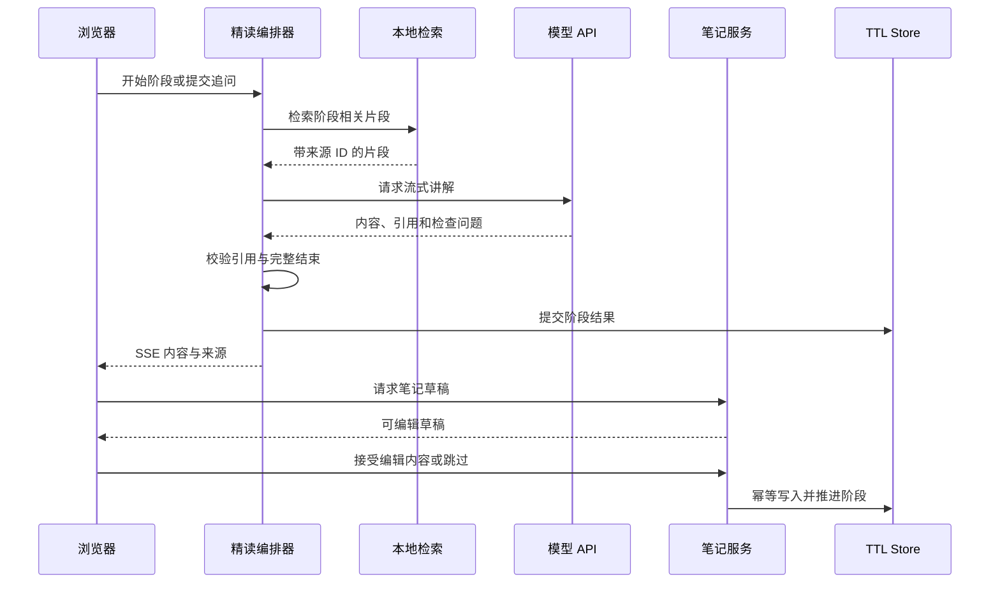

# 系统架构设计

- 版本：`v0.2`
- 状态：P5 本地实现完成
- 日期：2026-09-01

## 1. 架构目标

系统只处理一份用户明确提供的技术文档，在匿名临时会话中完成“导入 → 阅读画像 → 文档地图 → 阶段精读 → 笔记确认 → 导出”。架构不承担通用聊天、搜索引擎或知识库职责。

## 2. 系统边界



唯一外部服务是模型 API 和用户明确指定的公开 URL。系统不主动发现或搜索其他来源。

## 3. 核心组件

### 来源网关

- 统一文件上传和 URL 导入。
- 执行类型、大小、URL、DNS/IP、超时和重定向校验。
- 生成来源元数据与解析告警。

### 解析与索引

- 将不同格式转换为统一 `SourceChunk`。
- 保留页码、标题路径、代码标记和规范关键词。
- 建立会话级本地索引，不生成长期知识库。

### 精读流程编排器

- 根据阅读画像生成文档地图和阶段路线。
- 管理当前阶段、检查问题、追问和完成状态。
- 检索本轮来源并分配引用 ID。
- 校验模型结构化结果和引用。
- 流式请求成功结束后才原子提交阶段结果。

### 确认式笔记服务

- 从已完成阶段生成笔记草稿。
- 接受用户编辑后的内容，保证幂等写入。
- 跳过草稿不会写入最终笔记。
- 使用固定模板导出 Markdown。

## 4. 核心数据模型

```ts
type ReadingGoal = "overview" | "mechanism" | "implementation";
type Familiarity = "new" | "basic" | "experienced";
type DocumentGenre = "specification" | "policy" | "tutorial" | "architecture";
type DocumentScale = "document" | "book";

interface ReaderProfile {
  goal: ReadingGoal;
  familiarity: Familiarity;
  focus?: string;
}

interface SourceMetadata {
  id: string;
  kind: "upload" | "url" | "demo";
  title: string;
  filename?: string;
  url?: string;
  fetchedAt?: string;
  mediaType: string;
  pageCount?: number;
  genre: DocumentGenre;
  scale: DocumentScale;
  warnings: string[];
}

interface ParseQuality {
  textCoverage: number;
  lowTextPages: number[];
  imageCount: number;
  outlineConfidence: "high" | "medium" | "low";
  missingAssets: string[];
  warnings: string[];
}

interface SourceChunk {
  id: string;
  text: string;
  page?: number;
  headingPath: string[];
  containsCode: boolean;
}

interface Citation {
  chunkId: string;
  label: string;
  excerpt: string;
  page?: number;
  headingPath: string[];
}

interface ReadingStage {
  id: string;
  title: string;
  objective: string;
  sourceScopes: string[];
  rationale: string;
  status: "pending" | "active" | "awaiting_note" | "completed";
}

interface NoteDraft {
  id: string;
  stageId: string;
  content: string;
  status: "pending" | "accepted" | "skipped";
}
```

会话对象还保存路线、当前阶段、消息摘要和已接受笔记，但不保存密钥或长期原始文件。

## 5. API 契约

| 方法与路径 | 作用 | 主要输入 | 主要输出 |
| --- | --- | --- | --- |
| `POST /api/sessions` | 创建匿名会话 | 无 | 会话状态与过期时间 |
| `POST /api/sources/upload` | 导入文件 | 文件 | 来源元数据、结构与告警 |
| `POST /api/sources/import` | 导入公开 URL | URL | 来源元数据、结构与告警 |
| `POST /api/reading-plan` | 生成文档地图和路线 | `ReaderProfile` | 地图与 3–6 阶段 |
| `POST /api/reading/stages/:id/respond` | 讲解、追问或检查回答 | action、message | SSE 阶段内容、引用、检查问题 |
| `POST /api/notes/:stageId/draft` | 生成阶段草稿 | 无 | `NoteDraft` |
| `POST /api/notes/:stageId/accept` | 接受或跳过草稿 | draftId、action、editedContent | 阶段与笔记状态 |
| `GET /api/notes/export` | 下载笔记 | 无 | Markdown 文件 |
| `GET /api/health` | 健康检查 | 无 | 状态与应用版本 |

所有写接口必须校验会话 Cookie、请求 Schema、速率和业务状态。接受草稿接口以 `draftId` 幂等，重复请求不得重复写入。

## 6. 关键数据流

### 导入与路线



### 阶段与笔记



## 7. 业务状态约束

- 没有有效来源不能创建阅读路线。
- 没有阅读画像不能开始阶段。
- `book` 类型没有选定章节或主题范围时不能生成局部精读路线。
- 同时只能有一个 `active` 阶段。
- 流式响应未正常结束不能更新阶段完成状态。
- 只有 `awaiting_note` 阶段可以创建草稿。
- 只有接受或跳过草稿后才能把阶段标记为 `completed`。
- 导出只读取已接受草稿。

## 8. 引用可信机制

- 服务端为本轮检索片段分配短引用 ID，例如 `S1`。
- 模型只能返回本轮允许列表中的 ID。
- 服务端丢弃未知 ID，并在无有效引用时标记证据不足。
- 前端使用服务端 `Citation` 映射，不解析模型自造页码。
- URL 来源显示最终 URL 与抓取时间；上传来源显示文件名及页码/标题。

## 9. 安全边界

- 文档和网页内容只能作为数据，不能修改系统指令、调用工具或指定服务器路径。
- URL 的每次跳转都重新执行目标校验。
- 不执行脚本、不加载页面子资源、不自动跟随站内链接。
- 日志不记录全文、Cookie、密钥或完整模型上下文。
- Markdown 导出转义危险文件名，不渲染不可信 HTML。
- 公开 Demo 设置请求和会话上限，超限返回明确错误。

## 10. 故障与降级

| 故障 | 状态处理 | 用户反馈 |
| --- | --- | --- |
| 文档无可提取文本 | 不创建来源 | 提示使用文本型文件 |
| 动态网页无正文 | 不创建来源 | 提示上传网页导出文件 |
| URL 安全校验失败 | 不发出请求 | 提示该地址不可导入 |
| 本地检索无结果 | 不伪造上下文 | 显示文档证据不足 |
| 结构化模型输出无效 | 修复一次后失败 | 保留画像并允许重试 |
| SSE 中断 | 不提交阶段 | 保留输入并允许重试 |
| 草稿重复接受 | 返回既有结果 | 不重复加入笔记 |
| 会话过期 | 清理全部临时状态 | 提示重新导入 |
